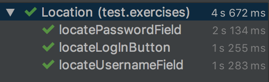

# Exercise 1: Locate Provided Elements
1.  Checkout branch `01_locate_elements `.
2. Navigate to **src > test > exercsies > Location**.
3. Visit [www.saucedemo.com](https://www.saucedemo.com) and use the developer tools to inspect the following elements:
    * Username Field
    * Password Field
    * Login Button
4. In the first `@Test` method called **`locateUsernameField()`**, paste the relevant values:
    ```
    String className = "";
    String tagName = "";
    Integer tagIndex = ;
    ```
5. Repeat the previous step for the following `@Test` methods:
    * `locatePasswordField()`
    * `locateLogInButton()`
6. Save your changes and run the **Location** class. You should see the following output:

    
    
7. The test failed because there is more than one **`input`** tag with the class name **`"log-input"`**. Navigate to the **`locatePasswordField()`** class method. Enter a valid CSS selector in the following:
    ```
    String cssSelector = "";
    ```
    > Use a browser developer tool to grab the css selector, for example in Chrome go to **View > Developer > Developer Tools** and right-click the element, then choose **Copy > Copy selector**
    
8. Save your changes and run the **Location** class. You should see the following output:

    
    
    <br />