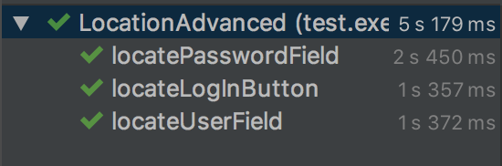

# Exercise 2: Implement Advanced Locators

1. Checkout branch `02_advanced_locations `.
2. Navigate to **src > test > exercises > LocationAdvanced**.
3. Visit [www.saucedemo.com](https://www.saucedemo.com) and use a browser developer tool to create, validate, and test CSS Selectors. For example in Google Chrome navigate to **View > Developer > Developer Tools** and use the console like so:
    
    > ##### xpath:
    ```
    $x(".//input")
    ```
    > ##### css:
    ```
    $$("input")
    ```
    > ##### example output:
    ```
    (3) [input.login-input, input.login-input, input.login-button]
    ```

4. In the first `@Test` method called **`locateUserField()`**, fill in the relevant values for the following css selectors:
    ```
    String cssClassName = "";
    String cssAttribute = "";
    String cssMultAttribute = "";
    String cssDescendant = "";
    String cssChild = "";
    ```
5. In the second `@Test` method called **`locatePasswordField()`**, fill in the releavnt values for the following css selectors:
    ```
    String cssDescendant = "";
    String css2ndChild = "";
    String cssSecondChildFromEnd = "";
    ```
6. Finally in the thrid `@Test` method called **`locateLogInButton()`**, fill in the relevant values for the following css selectors:
    ```
    String cssLastChild = "";
    String cssThirdChild = "";
    String cssAttributeStartsWith = "";
    String cssAttributeEndsWith = "";
    String cssAttributeContains = "";
    String cssPreviousSiblings = "";
    ```
7. Save your changes and run the **LocationAdvanced** class. You should see the following output in the console:

    
    
Checkout the next branch to see the answers.

<br />