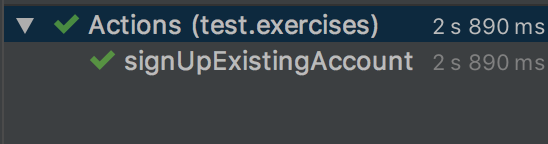

# Exercise 3: Create Element Actions

1. Checkout branch `03_test_actions`.
2. Navigate to **src > test > exercises > Actions**.
3. In the `@Test` method **`signUpExistingAccount()`**, make note of the following variables:
    ```
    String username = "standard_user";
    String password = "secret_sauce";
    String userField = "[data-test='username']";
    String passField = "[data-test='password']";
    String loginBtn = "[value='LOGIN']";
    ```
4. Under the comment ` // wait for username field`, create an explicit wait for the **`userField`** to render on the page
5. Under the comment ` // send username keystrokes`, create an element locator for **`userField`**, followed by a **`.sendKeys()`** action that uses ** `username`**.
6. Under the comment ` // send password keystrokes`, create an element locator for **`passField`**, followed by a **`.sendKeys()`** action that uses **`password`**.
7. Under the comment ` // click login button to submit keystrokes`, create an element locator for **`loginBtn`**, followed by a **`.click()`**.
8. Save your changes and run the **Actions** class, you should see the following output:
   
   
   Checkout the next branch to see the answers.
   <br />