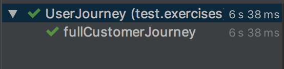

# Exercise 4: Implement Full Journey
1. Checkout branch `04_full_journey`.
2. Navigate to **src > test > exercsies > UserJourney**. 
3. Fill out the following **`String`** variables:
    ```
    String firstname = "";
    String lastname = "";
    String postal = "";
    ```
4. Save your changes and run the **UserJourney** class, you should see the following output:
    
    
    <br />