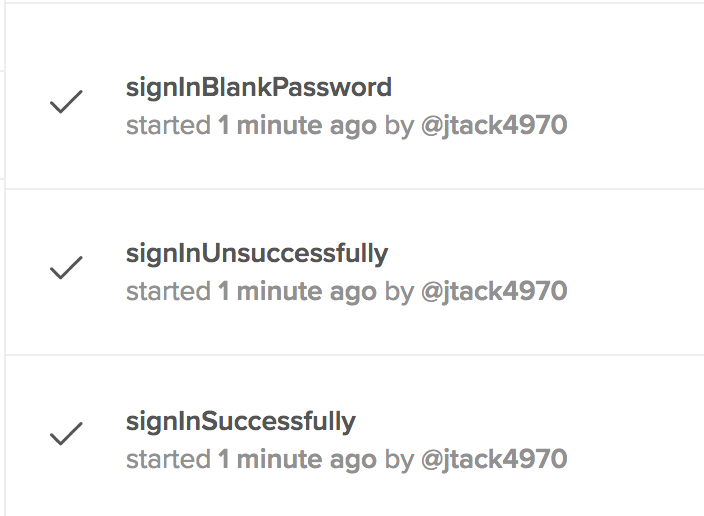

# Exercise 6: Create an Invalid User
1. Checkout branch `06_invalid_user`.
2. In **LogInTest**, note the new method called **`signInUnsuccessfully`**. There is a **`User`** object that we import from **`test.data.*`** that uses the `Faker` library located [here](https://github.com/DiUS/java-faker). Enter in the values below for the following variables:
    ```
    User user = new User(blankPassword);
    String username = user.getUsername();
    String password = user.getPassword();
    ```
3. Run the test for **`signInUnsuccessfully`**. The test failed as expected yet we don't want the actual test results to report a "failed" result because the failure is intentional. Instead, we can change our test assertion so that our test "passes" when checking for an unsuccessfull login.
    * In a browser, inspect the following error icon element:
        
    * Add an explicit wait and a css locator for the error icon:
    ```
    WebElement error = explicitWait.until(ExpectedConditions.presenceOfElementLocated(By.className("fa-times-circle")));
    String cssAttributeStartsWith = "svg[data-icon^=times]";
    ```
    * Change the **`Boolean result`** to test for the presence of the error icon:
    ```
    Boolean result = driver.findElements(By.cssSelector(cssAttributeStartsWith)).size() > 0;    
    ```
4. Change the test assertions to check whether or not the following CSS Selector matches against the **``WebElement error``** and if **`result`* is true:
    ```
    Assertions.assertEquals(error, driver.findElement(By.cssSelector(cssAttributeStartsWith)));
    Assertions.assertTrue(result);
    ```
5. Repeat steps 2 - 4 for the last `@Test` method, **`signInBlankPassword`**, with the one difference in how we declare the **`User`** object, like so:
    ```
    User user = User.blankPassword();
    ...
    ```
6. Save your changes and re-run the **LogInTest**. The **`signInUnsuccessfully`** test method should pass when you check both the IntelliJ console and the [www.saucelabs.com](www.saucelabs.com) automated test dashboard:

    * **IntelliJ Results:**
    
    
    
    * **Sauce Labs Dashboard:**
    
    